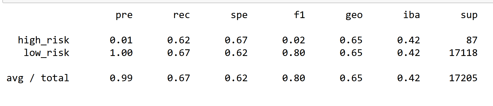
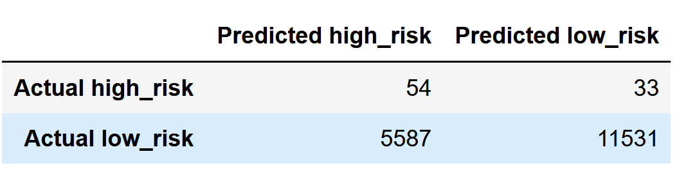

# Credit_Risk_Analysis

This project uses maching learning to calculate and predict cridit rick.

## Results

### Random Over Sampler model

Accuracy Score: 65%; Precision High Risk: 1%; Precision Low Risk: 100%; Recall High Risk: 62%; Recall Low Risk: 67%

### SMOTE model

Accuracy Score: 63%; Precision High Risk: 1%; Precision Low Risk: 100%; Recall High Risk: 62%; Recall Low Risk: 63%

### Cluster Centroids Undersampling

Accuracy Score: 51%; Precision High Risk: 1%; Precision Low Risk: 100%; Recall High Risk: 57%; Recall Low Risk: 46%

### SMOTEENN model

Accuracy Score: 62%; Precision High Risk: 1%; Precision Low Risk: 100%; Recall High Risk: 71%; Recall Low Risk: 54%

###  Balanced Random Forest Classifier model

Accuracy Score: 78%; Precision High Risk: 4%; Precision Low Risk: 100%; Recall High Risk: 91%; Recall Low Risk: 67%

###  Easy Ensemble Classifier model

Accuracy Score: 93%; Precision High Risk: 7%; Precision Low Risk: 100%; Recall High Risk: 91%; Recall Low Risk: 94%

## Summary:
 Almost all of the presented credit risk analysis models have poor certainty in assessing when a credit risk is elevated. However, the Easy Ensemble Classifier model has great accuracy along with balanced precision and recall scores. Therefore, the Easy Ensemble Classifier model is the only model that is recommended to be used for identifying the credit risk.
